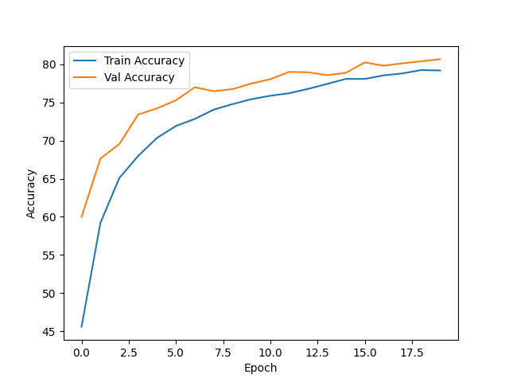
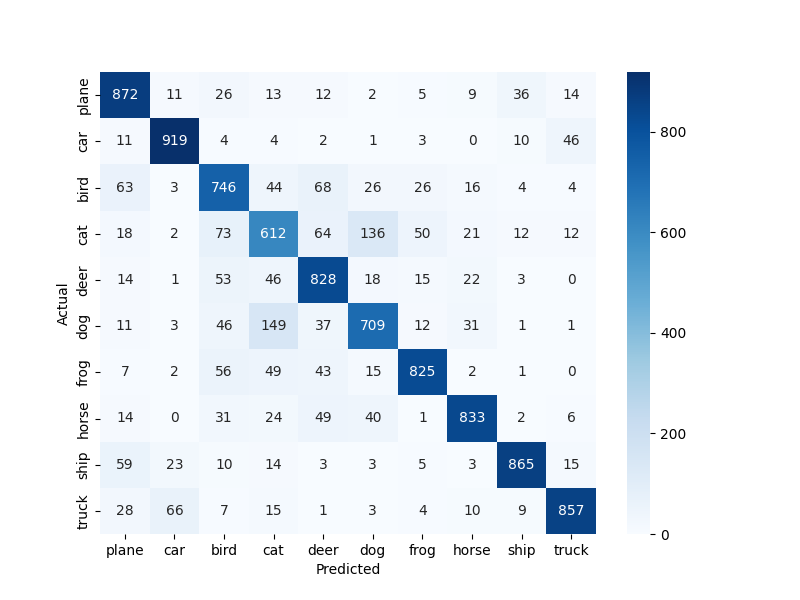

# 🚀 CIFAR-10 Image Classification using CNN (PyTorch)

A deep learning project that implements a Convolutional Neural Network (CNN) for image classification on the CIFAR-10 dataset. The model achieves ~80% accuracy using PyTorch with data augmentation and evaluation metrics.

---

## 📊 Dataset

This project uses the **CIFAR-10 dataset**, which contains:

- 60,000 color images (32×32 RGB)
- 10 classes:
  - airplane ✈️
  - automobile 🚗
  - bird 🐦
  - cat 🐱
  - deer 🦌
  - dog 🐶
  - frog 🐸
  - horse 🐴
  - ship 🚢
  - truck 🚚

🔗 Official Dataset:
The dataset is automatically loaded using:

```python
torchvision.datasets.CIFAR10
```
### 🧠 Model Architecture

A custom CNN inspired by AlexNet:

- Convolutional Layers (Conv2D)
- ReLU Activation
- MaxPooling Layers
- Fully Connected Layers
- Dropout for regularization

### ⚙️ Training Details
- Framework: PyTorch
- Loss Function: CrossEntropyLoss
- Optimizer: Adam
- Epochs: 20
- Batch Size: 64
- Image Size: 64×64 (resized from 32×32)


### 📈 Results
- ✅ Final Validation Accuracy: 80.66% 
- ✅ Train Accuracy: 79.18%
- ✅ Model shows good generalization (no major overfitting)


### 📊 Class-wise Performance

Best performing classes:

- Car 🚗
- Ship 🚢
- Truck 🚚

Challenging classes:

- Cat 🐱
- Dog 🐶
- Bird 🐦


### 📉 Visualizations
Accuracy Curve




Confusion Matrix



### 🚀 How to Run
### 1️.  Clone the repository
```
git clone https://github.com/YOUR_USERNAME/cifar10-image-classification-cnn.git
cd cifar10-image-classification-cnn
````
### 2️. Install dependencies
```
pip install -r requirements.txt
```

### 3. Run training
```
python main.py
```

### 4. Evaluate model 
```
python evaluate.py
```

### 5. Outputs

After running, results will be saved in:
```
outputs/
├── accuracy.png
├── confusion_matrix.png
```